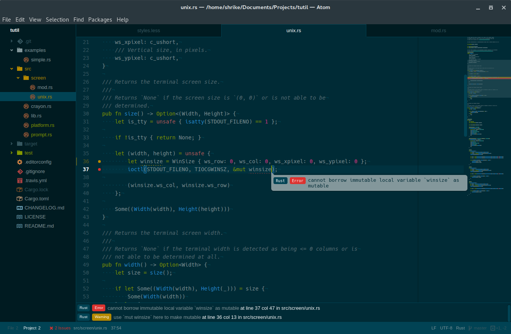
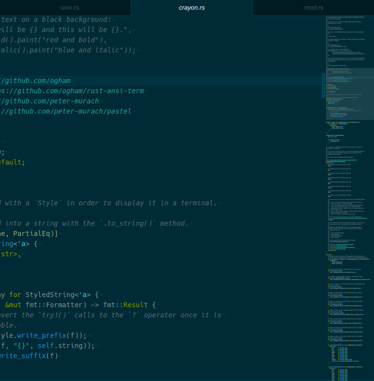
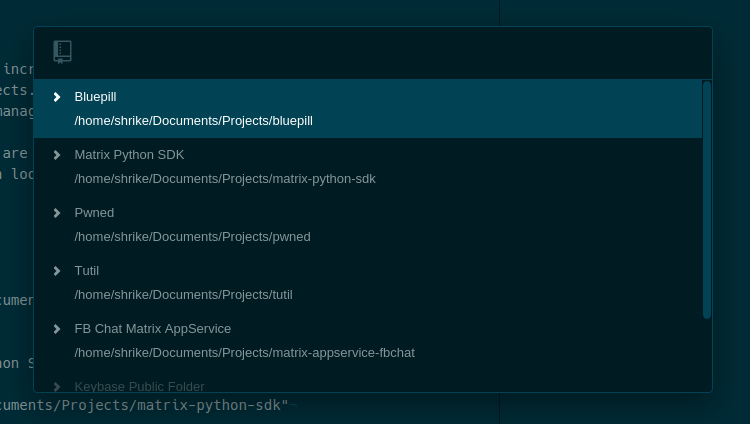
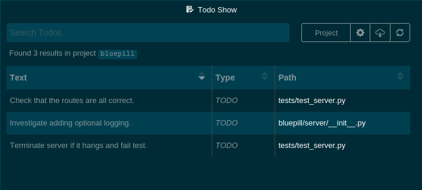

I've switched back to using Atom after having switched to [Spacemacs] around six
or eight months ago. Startup time — which was one of the factors that drove me
away — has noticeably improved to the point where I don't find it annoying and
the core text editing components have continued to mature.

There are still some things I miss about Emacs/[Spacemacs] however, such as the
mnemonic keybindings, [evil][evil] (essentially a Vim emulation layer for
Emacs), [which-key][which-key] (although it is partially replaced by the command
palette), and the ability to run it in a terminal. Also, keymaps are still
fairly painful to deal with, with packages often overriding keybindings from
either Atom core or other packages. In addition to this, there also still does
not seem to be any way to define keybindings that are context-aware, a feature
which would be useful for quite few packages that are only relevant with certain
filetypes — [markdown-preview], [asciidoc-preview], and [Emmet] are examples of
such packages.

In any case, I've switched back to Atom because I feel that it has sufficiently
matured and the way the editor is designed allows for a level of extensibility
that I think is essentially on par with Emacs, just without the harder to grasp
and slightly funky Emacs Lisp (although I will admit I wish it was written in
something *other* than JavaScript/CoffeeScript).

Now, let's get into what I've found to be useful and/or interesting Atom
packages that during day-to-day programming.

<!-- Links for Intro -->
[Spacemacs]: http://spacemacs.org/
[evil]: https://bitbucket.org/lyro/evil/wiki/Home
[which-key]: https://github.com/justbur/emacs-which-key
[markdown-preview]: https://atom.io/packages/markdown-preview
[asciidoc-preview]: https://atom.io/packages/asciidoc-preview
[Emmet]: https://atom.io/packages/emmet

## Linter

[Linter] is one of the first packages most people will want to install, and for
a good reason. Similar in functionality to [Flycheck] for Emacs, [Syntastic] for
Vim, and [SublimeLinter] for Sublime Text, Linter is a package for automatically
running static code analysis, style checkers, and linters on your code either as
you type *or* on each save. It adds a live collection of errors at the bottom of
the window as well as indicators in the gutter and popups containing the error
message when relevant code is selected.



<!-- Links for Linter -->
[Linter]: https://atom.io/packages/linter
[Flycheck]: http://www.flycheck.org/
[Syntastic]: https://github.com/scrooloose/syntastic
[SublimeLinter]: http://www.sublimelinter.com/

## Minimap

The [Minimap] package will be instantly recognisable to anyone who has used
Sublime Text. It provides — as the name suggests — a zoomed out view of the
current buffer. What makes the minimap package unique is the ability to extend
it with extra features, such as
[displaying the current line the cursor is at][minimap-cursorline],
[displaying currently selected text][minimap-selection],
[displaying linter information][minimap-linter], and
[displaying Git diff information][minimap-git-diff].



<!-- Links for Minimap -->
[Minimap]: https://atom.io/packages/minimap
[minimap-cursorline]: https://atom.io/packages/minimap-cursorline
[minimap-selection]: https://atom.io/packages/minimap-selection
[minimap-linter]: https://atom.io/packages/minimap-linter
[minimap-git-diff]: https://atom.io/packages/minimap-git-diff

## EditorConfig

[EditorConfig] is incredibly useful for maintaining the same coding style across
different editors and people. It's actually not only an Atom package, it is a
file format *and* a collection of text editor plugins; in fact, if it was
exclusive to Atom its usefulness would be hindered greatly.

EditorConfig reads a `.editorconfig` file at your project's root, in which you
define preferences such as the preferred EOL character, charset, indent size,
etc.

Here's an example:

```ini
root = true

[*]
charset = utf-8
end_of_line = lf
indent_style = space
insert_final_newline = true

[*.rs]
indent_size = 4

[*.{md,toml}]
indent_size = 2

[.travis.yml]
ident_size = 2
```

You can find the Atom package for it [here](editorconfig-package).

<!-- Links for EditorConfig -->
[EditorConfig]: http://editorconfig.org/
[editorconfig-package]: https://atom.io/packages/editorconfig

## Project Manager

[Project Manager] is incredibly simple and does exactly what the name implies —
it manages your projects. Usage is fairly simple: open the command palette and
search for "project manager"; from there you can save, edit, and list projects
like you would expect.



The list of projects are stored in a simple CSON file called `projects.cson`
under `~/.atom` which looks like this:

```cson
bluepill:
  title: "Bluepill"
  paths: [
    "/home/shrike/Documents/Projects/bluepill"
  ]
matrixpythonsdk:
  title: "Matrix Python SDK"
  paths: [
    "/home/shrike/Documents/Projects/matrix-python-sdk"
  ]
tutil:
  title: "Tutil"
  paths: [
    "/home/shrike/Documents/Projects/tutil"
  ]
```

<!-- Links for Project Manager -->
[Project Manager]: https://atom.io/packages/project-manager

## Todo Show

Another incredibly simple, but useful package is [Todo Show]. Put succinctly, it
finds all "TODO", "FIXME", etc. comments in the currently open project and
displays them in an overview list.



<!-- Links for Todo Show -->
[Todo Show]: https://atom.io/packages/todo-show
